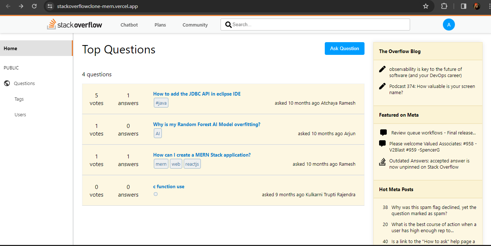

<div align="center">
  <h2 align = "center"> Stack Overflow Clone</h2>
  <h4 align = "center">facilitating community-driven question and answer interactions</h4>

 
</div>

###

- Integrated a chatbot and also Integrated a user community feature, enabling users to like and comment on shared media posts
- Used MongoDB for  Storing data.

## Installation


   **Clone the repository:**

   ```bash
   git clone https://github.com/BalaAtchaya2004/Stackoverflowclone_Mern
```





