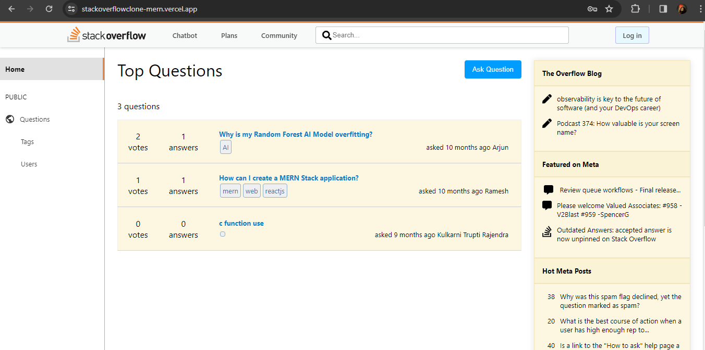
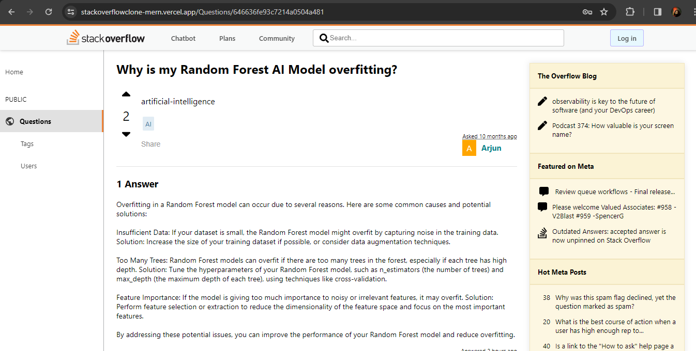

<div align="center">
  <h1 align = "center"> Stack Overflow Clone</h1>
  
  <h4 align = "center">Facilitating community-driven question and answer interactions</h4>

 
</div>

###

- Integrated a chatbot and also Integrated a user community feature, enabling users to like and comment on shared media posts
- Used MongoDB for  Storing data.

## Installation


   **Clone the repository:**

   ```bash
   git clone https://github.com/BalaAtchaya2004/Stackoverflowclone_Mern
```

  **Navigate to the project directory:**

   ```bash
   cd Stackoverflowclone_Mern
```


  **Install dependencies:**

   ```bash
   npm install
```


  **Set up environment variables:**
Create a .env file in the root directory and add the following variables:
   ```bash
PORT=5000
MONGODB_URI=your_mongodb_url
JWT_SECRET=your_jwt_secret
```


**Start the server:**

   ```bash
cd server
npm start
```


**Frontend Development Server:**

   ```bash
cd client
npm start
```




